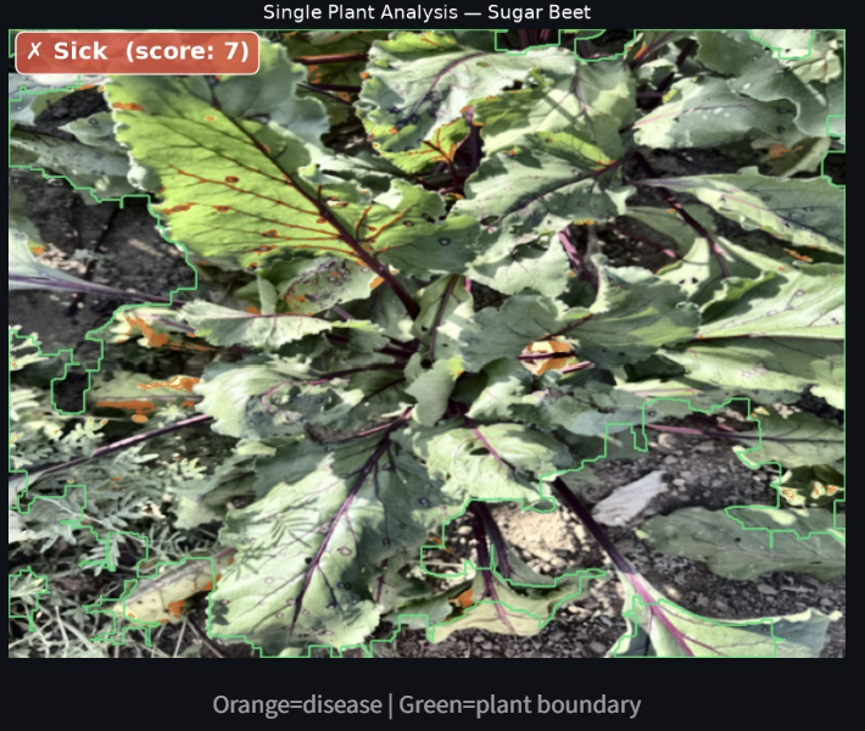
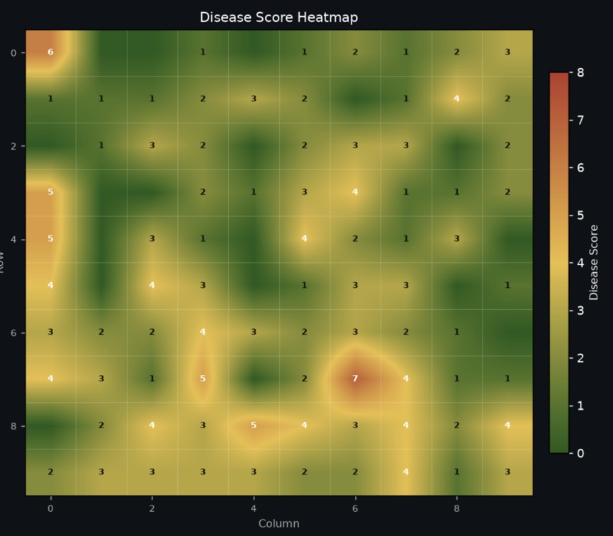
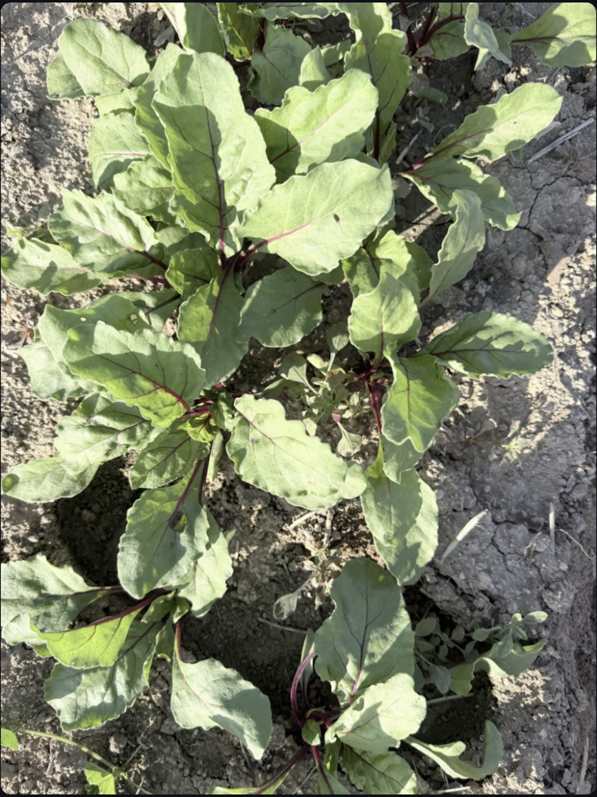
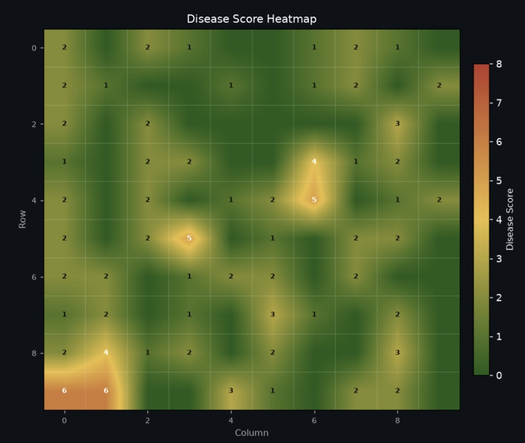
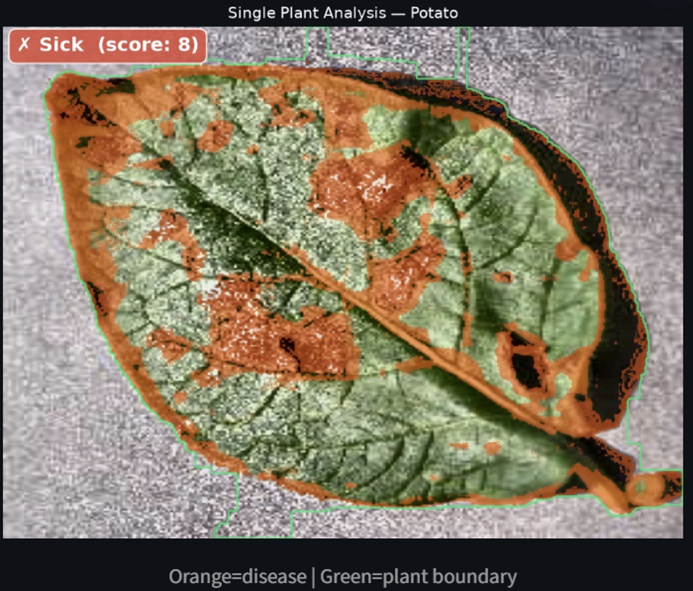
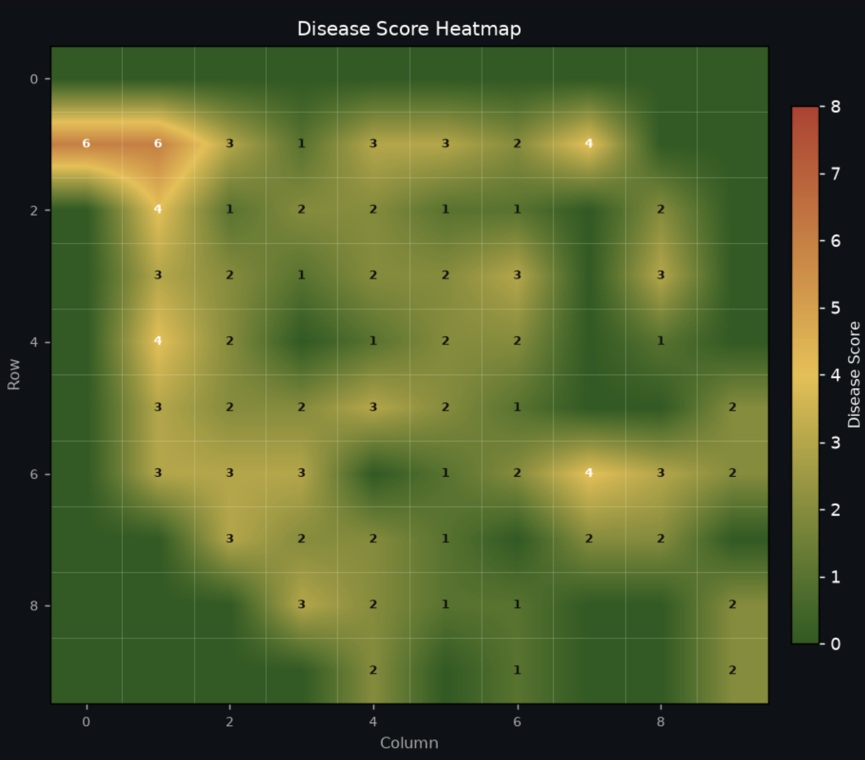

# 🌱 Drone-Based Crop Disease Detection

**Final Year Project – B.Sc. Electrical Engineering**  
**Afeka Academic College of Engineering**

A drone-based RGB image-processing system for locating visually suspicious areas in potato and sugar beet crops using classical image processing and crop-specific rule-based classification.

---

## Project Overview

The project develops a low-cost decision-support system for agricultural crop monitoring.

Field images are acquired using a commercial RGB drone camera and processed locally on a ground computer. The system analyzes the visual characteristics of the vegetation and classifies the analyzed regions into three levels:

- 🟢 **Healthy**
- 🟡 **Suspicious**
- 🔴 **High Suspicion**

Regions with insufficient vegetation are marked as **No Plant** and are excluded from the plant-health classification.

The system is designed to support field inspection and does **not** provide a definitive agronomic diagnosis.

---

## Project Team

- **Daniel Haim**
- **Ofri Azar**
- **Ido Dayan**

**Project Advisor:** Yirmiyahu Hauptman  
**Field Site:** Kibbutz Nahal Oz, Israel

---

## Target Crops

### Potato

Reference data include:

- Healthy
- Early Blight
- Late Blight

### Sugar Beet

Reference data include:

- Healthy / Unaffected
- Cercospora Leaf Spot

The implemented system does not directly predict a specific disease name.  
Instead, the crop-specific algorithms evaluate visual abnormalities and return a health level:

`Healthy → Suspicious → High Suspicion`

Separate processing and scoring rules are used for potato and sugar beet because the crops differ in leaf structure, color distribution and visual disease characteristics.

---

## System Architecture

The project combines an aerial acquisition stage with a local ground-processing stage:

```text
DJI Mavic 2 Pro + RGB Camera
            │
            ▼
      Image Acquisition
            │
            ▼
      microSD Storage
            │
            ▼
     Transfer to PC
            │
            ▼
 Image Quality Assessment
            │
            ▼
      Preprocessing
            │
            ▼
      RGB → HSV
            │
            ▼
 Vegetation Segmentation
            │
            ▼
 Morphological Processing
            │
            ▼
   Feature Extraction
            │
            ▼
 Crop-Specific Scoring
            │
            ▼
 Healthy / Suspicious /
     High Suspicion
            │
            ▼
 Overlay + Heatmap + Grid
            │
            ▼
      CSV / Report Export
```

Processing is performed locally after the flight and does not require continuous cloud connectivity.

---

## Image-Processing Pipeline

The main processing stages are:

1. Image upload
2. Image quality assessment
3. Grayscale conversion
4. Noise reduction
5. Contrast enhancement
6. RGB-to-HSV conversion
7. Vegetation segmentation
8. Morphological mask cleaning
9. Vegetation isolation
10. Feature extraction
11. Crop-specific rule-based scoring
12. Regional classification
13. Classification overlay
14. Disease-score heatmap
15. Classification grid
16. CSV and report export

Intermediate outputs are displayed in the user interface to support algorithm inspection, calibration and engineering validation.

---

## Crop-Specific Features

### Potato

The potato classifier uses visual features such as:

- Brown-pixel ratio
- Yellow-pixel ratio
- Green-pixel ratio
- Dark-pixel ratio
- Mean saturation
- Vegetation coverage

The extracted features are evaluated using a deterministic scoring mechanism.

### Sugar Beet

The sugar beet classifier uses features including:

- Yellow-pixel ratio
- Mean saturation
- High-saturation ratio
- Hue entropy
- Green coverage
- Dark-pixel ratio
- Vegetation coverage

A separate scoring mechanism is used for sugar beet.

---

## Image Quality Assessment

Each input image is evaluated before classification.

Quality indicators include:

- Sharpness
- Mean brightness
- Dark-pixel percentage
- Overexposed-pixel percentage
- Image validity status

This stage helps identify images that may not be suitable for reliable processing.

---

## Spatial Analysis

For field images, the image is divided into a configurable grid.

Each grid cell is processed independently and assigned a classification result.

The system generates:

- **Classification Overlay**
- **Disease Score Heatmap**
- **Classification Grid**
- **Summary statistics**

The current implementation represents spatial position relative to the input image.

It does **not** generate a GPS-based geographic field map because reliable GPS/EXIF coordinates were not available for all project images.

---

## Ground Truth / Reference Label

The user interface allows an optional reference label to be assigned before analysis.

This label can be used to compare the algorithm prediction with a known or manually assigned reference class.

For evaluation purposes:

- `Healthy` is treated as a negative result.
- `Suspicious` and `High Suspicion` are treated as positive detections.

This enables calculation of:

- True Positive (TP)
- True Negative (TN)
- False Positive (FP)
- False Negative (FN)
- Accuracy
- Precision
- Recall
- F1 Score

---

## Experimental Evaluation

Three experimental evaluation rounds were documented, with **30 images per experiment**.

| Experiment | Crop | Accuracy | Precision | Recall | F1 |
|---|---|---:|---:|---:|---:|
| Experiment 1 | Potato | 76.7% | 100.0% | 56.2% | 72.0% |
| Experiment 2 | Potato | 86.7% | 100.0% | 80.0% | 88.9% |
| Experiment 3 | Potato + Sugar Beet | 83.3% | 83.3% | 76.9% | 80.0% |

Across the three documented experiments:

- **90 images** were evaluated
- **35 TP**
- **39 TN**
- **2 FP**
- **14 FN**
- **Overall Accuracy:** 82.2%
- **Overall Precision:** 94.6%
- **Overall Recall:** 71.4%
- **Overall F1 Score:** 81.4%

The project design target for classification accuracy was approximately **85% or higher**.

Experiment 2 exceeded this target, while Experiment 3 was close to the target.

The experimental results also show that most classification errors were False Negatives, indicating that improving recall is an important direction for further calibration.

> These values summarize the documented experimental evaluation. They should not be interpreted as a universal agricultural-diagnosis accuracy.

---

## Processing Time

The design requirement was:

```text
Processing time < 5 seconds per image
```

Across the 90 evaluated images:

- **Mean processing time:** approximately 0.41 s/image
- **Maximum measured processing time:** approximately 1.46 s/image

All evaluated images therefore satisfied the defined processing-time requirement.

Processing time depends on image resolution and the selected grid size.

---

## Datasets

### PlantVillage – Potato

Used as a reference dataset for:

- Healthy potato leaves
- Early Blight
- Late Blight

PlantVillage images are used for algorithm development, calibration and controlled evaluation.

### Zenodo – Sugar Beet

The sugar beet reference images were obtained from a public Zenodo dataset.

**Zenodo Record:** `15873360`

Reference classes include:

- Unaffected / Healthy
- Cercospora Leaf Spot

### Project Field Images

Field images were collected by the project team during three photography sessions at Kibbutz Nahal Oz.

```text
Experiment 1 – Potato
Experiment 2 – Potato
Experiment 3 – Potato
Experiment 3 – Sugar Beet
```

Field images are used to evaluate the system under realistic agricultural conditions, including variable lighting, soil background, shadows, overlapping vegetation and non-uniform viewpoints.

Full external datasets are not redistributed in this repository.

---

## User Interface

The system is implemented as a **Streamlit** application.

The interface allows the user to:

- Select the crop type
- Upload a JPG / JPEG / PNG image
- Select the field-grid resolution
- Optionally enter a reference label
- Run the image-processing pipeline
- Inspect intermediate processing stages
- View extracted features
- View the classification result
- View the field overlay
- View the disease-score heatmap
- Export results to CSV
- Export organized output files

---

## Installation

### 1. Clone the repository

```bash
git clone https://github.com/danielhaim260001-del/drone-crop-disease-detection.git
cd drone-crop-disease-detection
```

### 2. Install dependencies

```bash
pip install -r requirements.txt
```

### 3. Run the application

```bash
streamlit run app.py
```

The Streamlit interface will open in the browser.

---

## Main Project Files

```text
app.py
```

Main Streamlit application and user interface.

```text
config.py
```

Central project configuration and common definitions.

```text
pipeline_common.py
```

Shared image-processing utilities.

```text
potato_detector.py
```

Potato-specific image-processing and classification logic.

```text
beet_detector.py
```

Sugar-beet-specific image-processing and classification logic.

```text
requirements.txt
```

Python dependencies required to run the project.

---

## Repository Structure

```text
drone-crop-disease-detection/
│
├── app.py
├── config.py
├── pipeline_common.py
├── potato_detector.py
├── beet_detector.py
├── requirements.txt
├── README.md
├── .gitignore
│
├── data/
│   ├── samples/
│   │   ├── potato/
│   │   │   ├── healthy/
│   │   │   ├── early_blight/
│   │   │   └── late_blight/
│   │   └── beet/
│   │       ├── healthy/
│   │       └── cercospora/
│   │
│   ├── field/
│   │   ├── experiment_1_potato/
│   │   ├── experiment_2_potato/
│   │   ├── experiment_3_potato/
│   │   └── experiment_3_beet/
│   │
│   └── metadata/
│
├── outputs/
│   ├── potato/
│   ├── beet/
│   └── field_maps/
│
└── tests/
```

---

## Main Outputs

The system can generate:

- Original image
- Grayscale image
- Preprocessed image
- HSV representation
- Vegetation mask
- Cleaned binary mask
- Isolated vegetation
- Extracted feature values
- RGB / HSV histograms
- Single-image classification
- Classification overlay
- Disease-score heatmap
- Classification grid
- Experiment summary
- CSV results

---
## Example Results

The following examples demonstrate representative outputs generated by the image-processing and crop-health classification pipeline.

The examples include the classification result, disease score, confidence value, vegetation coverage, classification overlay and disease-score heatmap.

### Diseased Sugar Beet



| Parameter | Result |
|---|---|
| Crop | Sugar Beet |
| Classification | Sick |
| Disease Score | 7 |
| Confidence | 85.2% |
| Vegetation Coverage | 94.4% |
| Processing Time | 0.902 s |

The green contour represents the detected vegetation boundary, while the orange regions indicate visually suspicious areas identified by the algorithm.

#### Disease Score Heatmap



The heatmap illustrates the spatial distribution of disease scores across the image. Higher scores indicate regions with stronger visual abnormalities.

---

### Healthy Sugar Beet



| Parameter | Result |
|---|---|
| Crop | Sugar Beet |
| Classification | Healthy |
| Disease Score | 2 |
| Confidence | 85.2% |
| Vegetation Coverage | 85.2% |
| Processing Time | 1.026 s |

The low disease score is consistent with a healthy classification.

#### Disease Score Heatmap



---

### Diseased Potato Leaf



| Parameter | Result |
|---|---|
| Crop | Potato |
| Classification | Sick |
| Disease Score | 8 |
| Confidence | 99.9% |
| Vegetation Coverage | 64.4% |
| Processing Time | 0.763 s |

The algorithm identified several visually suspicious regions across the potato leaf.

#### Disease Score Heatmap



---

## Technologies

The project is implemented in Python and uses:

- **Python**
- **OpenCV**
- **NumPy**
- **Matplotlib**
- **scikit-image**
- **Pandas**
- **Pillow**
- **Streamlit**

---

## Engineering Design Choices

The final system was intentionally designed around:

- Standard RGB imaging instead of a dedicated multispectral sensor
- Classical image processing instead of a trained deep-learning model
- Crop-specific feature extraction and scoring
- Local processing instead of cloud-dependent processing
- Transparent intermediate outputs for engineering validation
- Separate processing logic for potato and sugar beet
- A simple visual output suitable for field inspection

These choices reduce hardware and computational complexity while maintaining a transparent and inspectable processing pipeline.

---

## Current Limitations

The current prototype has several limitations:

- Classification is based on visible RGB characteristics only.
- Results can be affected by lighting, shadows, soil background and image quality.
- Classification thresholds require continued calibration on larger field datasets.
- Field imagery may differ significantly from controlled public-dataset images.
- The current spatial output is image-relative and not GPS-referenced.
- The system detects visual abnormalities and does not provide definitive agronomic diagnosis.

---

## Future Work

Possible extensions include:

- Larger labeled field datasets
- Improved crop segmentation
- Automated threshold calibration
- Sensitivity analysis of classification thresholds
- GPS / EXIF integration for geographic mapping
- Comparison with machine-learning and deep-learning approaches
- Comparison with multispectral imaging
- Improved recall and reduction of False Negative detections

---

## Project Disclaimer

This repository contains an **engineering research prototype** developed as part of a B.Sc. final project.

The system is intended for experimental crop-monitoring and decision-support purposes only.

It is **not a substitute for professional agronomic diagnosis**.

---

## Repository

**GitHub:**  
https://github.com/danielhaim260001-del/drone-crop-disease-detection
